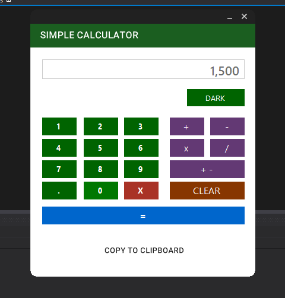

# MY SIMPLE CALCULATOR IN C#

* Purpose: My Project
* Programming Language: C#
* Version: C# 5.0
* Target Framework: .Net Framework 4.5
* IDE: MS Visual Studio 2012
* Type of Application: Desktop Application (Windows Forms Application)
* User Interface Design: Material Skin Framework
